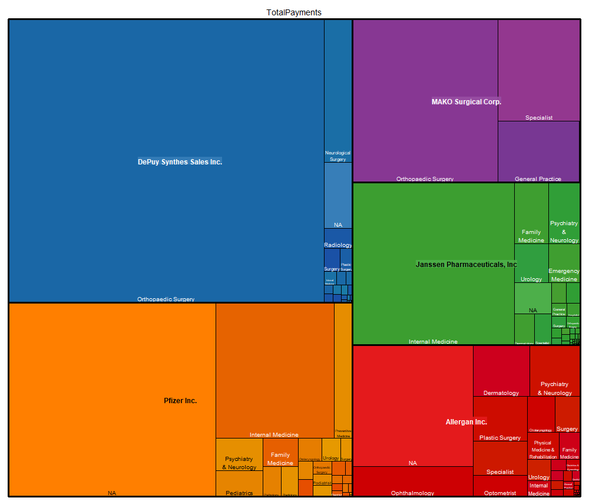

```{r setup, include=FALSE}
knitr::opts_chunk$set(echo = TRUE)
```

```{r loadpkg, include=TRUE,echo=FALSE, message=FALSE}
library(RSQLite)
library(DBI)
library(tidyr)
library(ggplot2)
#library(plotly)
```

## Data Preparation

```{r fetchdata, include=TRUE,echo=FALSE, message=FALSE}
cwd <- paste0(getwd())
setwd(cwd)

download.file(url = "https://s3.amazonaws.com/istreet-assets/i0jhsz_Udi_Zl2jxJ-c-pQ/CMS_OPEN_PAYMENTS_DEC_2013.zip"
              ,destfile = "CMS_OPEN_PAYMENTS_DEC_2013.zip")


cmszip <- unzip("CMS_OPEN_PAYMENTS_DEC_2013.zip")
cmspayments <- read.csv(cmszip)
```


### Top Companies Prep
Bring top companies into dataframe.

```{r toppayer, echo=TRUE,include=TRUE}
#names(cmspayments)
#Companies is "Submitting_Applicable_Manufacturer_or_Applicable_GPO_Name"
toppayor <- aggregate(Total_Amount_of_Payment_USDollars ~ Submitting_Applicable_Manufacturer_or_Applicable_GPO_Name
                                                        
                      ,cmspayments,FUN = sum)
colnames(toppayor) <- c("Company","TotalPayment")
toppayor <- head(toppayor[order(toppayor$TotalPayment, decreasing= TRUE),], n = 10)
```


```{r physspecial_split,echo=TRUE, include=TRUE}
abc <- separate(data = cmspayments,col= Physician_Specialty 
                ,into = "NA", sep = "[|]", remove = TRUE,
                convert = FALSE
                ,extra = "merge")
#, extra = "warn", fill = "warn", ...)
```

### Simplify the data manipulation
Using RSQLite, use SQL to simplify data manipulation.

Using the top companies dataframe, write to table. 
```{r sqltransform, echo=TRUE, include=TRUE}
rsqlcon <- dbConnect(RSQLite::SQLite(), ":memory:")

dbWriteTable(conn = rsqlcon
             ,"cmspaytable"
             ,cmspayments
             ,overwrite = TRUE)

topCompany <- RSQLite::dbGetQuery(conn = rsqlcon
                                ,"select Submitting_Applicable_Manufacturer_or_Applicable_GPO_Name as Company
                                        ,sum(Total_Amount_of_Payment_USDollars) as TotalPayments
                                  from cmspaytable
                                  group by 1
                                  order by 2 desc
                                  limit 10"
                                  )
##has top company by revenue
dbWriteTable(conn = rsqlcon
             ,"topcompanytable"
             ,topCompany
             ,overwrite = TRUE)
print(topCompany)
```


Create a dataset with company, payment specialty, and total payments. Group by the attributes and sum the measures.
Then get the top companies with specialty only if they exist in the top 10 companies data frame.


```{r topspecialty, echo= TRUE, include= TRUE}
topspecialty <- RSQLite::dbGetQuery(conn = rsqlcon
                    , "select c.Submitting_Applicable_Manufacturer_or_Applicable_GPO_Name as Company
                             ,c.Physician_Specialty
                             ,sum(c.Total_Amount_of_Payment_USDollars) as TotalPayments
                       from cmspaytable as c inner join (select distinct Company
                                          from topcompanytable
                                          order by topcompanytable.TotalPayments desc
                                          limit 5
                                          ) as tt on c.Submitting_Applicable_Manufacturer_or_Applicable_GPO_Name
                                                   = tt.Company
                       group by 1,2
                       order by 3 desc,2,1
                    ")

print(topspecialty)
```

## Visualize
1. Top 10 companies barchart
2. Top 5 companies


```{r visualize,include=TRUE, echo=TRUE}

#plot_ly(x = c(topCompany$Company)
#       ,y = c(topCompany$TotalPayments)
#       ,type = "bar")
#par(mfrow - c(2,2))
g <- ggplot(topCompany,aes(Company,TotalPayments/1000000))
g+geom_bar(stat = "identity"
           ,colour = "dark blue"
           ,fill = "dodger blue") +theme(axis.text.x = element_text(angle=45
                                                                ,hjust = 1)
                                     ,axis.text.y = element_text(angle = 45)
                                     )+ labs(y = "Total Payments")+geom_line()+
                geom_hline(yintercept = mean(topCompany$TotalPayments/1000000), color="blue")
```

```{r topspecialtysummary, echo=TRUE,include=TRUE}
summa
```


```{r visualizespecialty_copy, echo=FALSE,include=FALSE}
#plot_ly(x = c(topCompany$Company)
#       ,y = c(topCompany$TotalPayments)
#       ,type = "bar")
#par(mfrow - c(2,2))
ts <- aggregate(TotalPayments~Physician_Specialty,topspecialty,sum)


b <- ggplot(topspecialty,aes(Company,TotalPayments/1000000
                           ,fill = rep(unlist(Physician_Specialty)))
            )

b+geom_bar(stat = "identity"
           ,colour = "dark blue"
           ,fill = "dodger blue") +theme(axis.text.x = element_text(angle=45
                                                                ,hjust = 1)
                                     ,axis.text.y = element_text(angle = 45)
                                     )+ labs(y = "Total Payments")
```

```{r treemap, echo=TRUE,include=TRUE}

### use ping to produce image and control size.
specialtytree <- file.path(getwd(),paste("specialtytreemap",".png",sep = ""))
png(filename = specialtytree,
    width = 1000, height = 850, units = "px", pointsize = 12,
    bg = "white",  res = NA,## ...,
    ##type = c("cairo", "cairo-png", "Xlib", "quartz"), 
    antialias = c("default")
)


treemap::treemap(dtf = topspecialty, index = c("Company","Physician_Specialty")
                 ,type = "index"
                 , fontsize.labels=c(12,10,10)
                 ,vSize = "TotalPayments"
                 ,vColor = "Physician_Specialty"
                 ,command.line.output = FALSE
                 #,fontface.labels = "bold"
                 ,palette = "Set1"
                 ,fun.aggregate = "sum"
                 , align.labels=list(
                                      c("center", "center"), 
                                      c("center", "bottom")
                                      )
                  )
dev.off()
```




